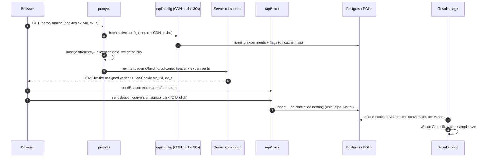

# Edge Experiments

[English](README.md) · [Português](README.pt-BR.md)

A/B tests and feature flags for landing and sales pages, assigned in Next.js `proxy.ts` before the page renders, with a results page that does the statistics properly.

[](https://github.com/trichains/edge-experiments/actions/workflows/ci.yml)
[](LICENSE)
[](https://edge-experiments.vercel.app)


## Why

Landing pages and VSL sales pages get A/B tested all the time: headline, call to action, offer, social proof. The usual tools do it in the browser: the page loads with the original copy, a script decides the variant, then swaps the DOM. That causes a visible flash of the wrong content, adds a render-blocking script to the page that matters most for conversion, and often gets an anti-flicker "hide the page until we decide" snippet bolted on top.

The variant decision doesn't need the browser. It needs a visitor id, the experiment config and a hash. This project makes that decision in Next.js `proxy.ts` (the Next 16 replacement for middleware), before any HTML is produced, so the visitor gets the right variant on the first byte. Then it records exposures and conversions per unique visitor and shows the results with confidence intervals and a significance test instead of a raw "B is 12% better" number.

## What it does

- **Experiment and flag definitions** in Postgres via Drizzle, validated with zod: status (draft, running, paused, finished), traffic allocation, weighted variants, targeting rules (UTM source/medium equals, country from `x-vercel-ip-country`, mobile/desktop from the user agent), primary goal, and `rewrite` or `header` mode. Flags have enabled, rollout % and a kill switch.
- **Deterministic bucketing**: FNV-1a 32-bit (plus the murmur3 finalizer for better bit mixing) over `${visitorId}:${experimentKey}`, mapped to [0, 1). A separately salted hash drives the traffic allocation gate, so raising allocation from 20% to 50% only adds visitors and never moves anyone who was already enrolled.
- **Edge evaluation in `proxy.ts`**: reads the `ex_vid` cookie (or mints a UUID), reads the `ex_a` assignments cookie, assigns new experiments, sets both cookies, forwards the result to server components in the `x-experiments` / `x-flags` request headers, and for `rewrite` experiments rewrites `/demo/landing` to `/demo/landing/<variant>` behind the same URL.
- **No database in the proxy**: it fetches `GET /api/config`, a small JSON document served with `Cache-Control: s-maxage=30, stale-while-revalidate=300`.
- **SDK** in `lib/sdk`: `getAssignments()`, `getVariant(key)`, `getFlag(key)` on the server; `<ExperimentsProvider>`, `useVariant(key)`, `useFlag(key)` and `track(goal, props)` on the client. Variant unions are typed through a registry interface (`getVariant("landing-hero")` is `"control" | "outcome" | null`).
- **Tracking**: `navigator.sendBeacon('/api/track')` for exposures (once the page mounts) and conversions. A unique index on (experiment, visitor, kind, goal) makes every event idempotent, so all counts are unique visitors.
- **Results page** (`/dashboard/experiments/[key]`): visitors and conversions per variant, conversion rate with a Wilson 95% interval, relative uplift vs. control, two-sided two-proportion z-test p-value, a verdict label, an interval chart and a sample size calculator (baseline, MDE absolute or relative, α = 0.05, power = 0.8). Start, pause and finish from the same page.
- **Flags page** (`/dashboard/flags`): toggle, rollout slider, kill switch.
- **Mutation access**: with `ADMIN_TOKEN` set, every change needs the token. Without it, changes are allowed only in sandbox mode; with a real database and no token they're refused.
- **Demo** (`/demo/landing`): a landing page for a fictional invoicing product with two hero variants (headline + CTA copy and color), a header-mode social proof experiment at 50% allocation, and two flags. A debug chip shows your variant and has a "switch variant" link. The results page has a sandbox-only **Simulate traffic** form that generates synthetic visitors with the true conversion rates you choose (up to 5,000 per run and 100,000 per experiment).

## Architecture



1. The proxy runs for page requests only (the matcher skips `/api`, `/_next` and static files).
2. It loads the config from `/api/config`, keeping a 30 s in-memory copy per instance on top of the CDN cache. Concurrent requests share one fetch. If the config can't be loaded, the request passes through untouched and the page renders its control; the failure is remembered for 5 s so a broken config endpoint isn't hit on every request.
3. Existing cookie assignments win while the experiment is running (sticky) and are forwarded on every page. New visitors are only enrolled on a request for the experiment's `path` (or below it): targeting first, then the allocation gate, then the weighted pick. Visitors who don't qualify aren't stored, so they're re-evaluated on the next request.
4. Server components read the assignment with `getVariant()` from the forwarded header. That covers the very first request too, before the cookie exists in the browser.
5. The client provider gets the same snapshot from the server, so hydration matches the HTML. After mount it sends one exposure beacon for the experiments the page actually rendered.
6. `/api/track` takes the visitor id and assignments from the first-party cookies, never from the body, and re-validates every pair against the config.

```
proxy.ts               edge evaluation (imports only lib/core)
instrumentation.ts     warms the DB / PGlite at boot
lib/core/              pure TS, no I/O: hash, bucketing, targeting, cookie format, evaluate, stats, zod schemas
lib/sdk/               server.ts (getAssignments/getVariant/getFlag), client.tsx (provider, hooks, track)
lib/db/                Drizzle schema, pg/PGlite client singleton, fixtures, seed
lib/server/            repository queries, admin token check
app/api/               config, track, flags/[key], experiments/[key], simulate, debug/reset
app/(app)/             landing + dashboard (experiments list, results, flags)
app/demo/landing/      demo page; [variant]/ is the rewrite target
drizzle/               generated SQL migrations
tests/unit/            hash, bucketing, cookies, targeting, evaluate, stats
tests/integration/     route handlers on PGlite, proxy.ts with a mocked config fetch
e2e/                   Playwright smoke tests
```

## Key decisions and trade-offs

- **Assignment on the server, not in the browser.** The proxy decides before rendering, so the HTML already contains the right variant. No DOM swap, no anti-flicker snippet, no extra script on the critical path. The cost is that pages under an experiment are rendered per request instead of served from a static cache.
- **No database at the edge.** The proxy only reads a cached JSON config. A returning visitor costs zero lookups because their assignments travel in the `ex_a` cookie. In production on Vercel, [Edge Config](https://vercel.com/docs/edge-config) is the better home for this payload (fast reads at the edge, updates pushed globally); `/api/config` keeps the project self-contained. Config changes take up to about 30 s to reach visitors.
- **Cookie-based assignments, unsigned.** The format is compact (`landing-hero:outcome;social-proof:logos`, percent-encoded in the cookie because `;` isn't allowed in cookie values). It isn't signed: a visitor could edit it to pick a variant, which only changes their own experience, and the track endpoint ignores pairs that don't exist in the config. Both cookies are readable by JavaScript on purpose (`httpOnly: false`, `SameSite=Lax`, 1 year) since they only hold an anonymous id and variant keys.
- **Exposure via beacon, not during server render.** Recording exposure in a server component would count prefetches, RSC refetches and crawlers that never show the page to a person, and it would make rendering do writes. A beacon after mount only fires in a real browser that displayed the page. The trade-off: visitors who block JS or leave before hydration aren't counted as exposed.
- **Deterministic hashing with two salts.** The same visitor always lands in the same bucket, on any instance, without coordination. Variant pick and allocation gate use independent hashes, so changing allocation never reshuffles enrolled visitors. FNV-1a alone mixes poorly when inputs differ only at the end (`...:exp-a` vs `...:exp-b`), so the value goes through the murmur3 `fmix32` finalizer; the tests check uniformity with a chi-square test and independence across experiments.
- **Frequentist stats, explicit about their limits.** Wilson intervals behave well at low rates and small samples, where the normal approximation doesn't. The z-test matches R's `prop.test(correct = FALSE)`. The verdict is hidden below 100 visitors per variant. All formulas are unit-tested against published reference values.
- **Drizzle with two drivers.** `pg` when `DATABASE_URL` is set, PGlite in memory otherwise (sandbox mode: migrations applied at boot, fixtures seeded). Same schema, same queries, and the tests run on PGlite without Docker.
- **Direct hits on variant routes redirect.** `/demo/landing/outcome` redirects to `/demo/landing`, so nobody sees one variant while being counted in another.

## Stack

Next.js 16.3 (App Router, `proxy.ts`), React 19, TypeScript (strict), Tailwind CSS v4, Drizzle ORM with `pg` and `@electric-sql/pglite`, zod 4, Vitest, Playwright (Chromium).

## Running locally

Prerequisites: Node 22 or newer.

```bash
npm install
cp .env.example .env.local   # optional: leave DATABASE_URL empty for sandbox mode
npm run dev                  # http://localhost:3102
```

With Postgres:

```bash
# set DATABASE_URL in .env.local, then
npm run db:migrate           # applies drizzle/*.sql
npm run dev                  # seeds the demo fixtures if the experiments table is empty
```

| Variable | Required | Purpose |
| --- | --- | --- |
| `DATABASE_URL` | no | Postgres connection string. Empty means sandbox mode (in-memory PGlite). |
| `NEXT_PUBLIC_APP_URL` | recommended in production | Public URL, used for metadata. Falls back to `VERCEL_PROJECT_PRODUCTION_URL` on Vercel, then `http://localhost:3102`. |
| `ADMIN_TOKEN` | required to change anything when `DATABASE_URL` is set | Dashboard mutations require `Authorization: Bearer <token>`. Unset: open in sandbox mode, refused with a real database. |

Tests:

```bash
npm run lint
npm run typecheck
npm test                            # unit + integration (Vitest, PGlite)
npm run build && npm run test:e2e   # Playwright against the production build on port 3102
```

The statistics tests cite their references in the test file: R's `qnorm`/`pnorm` and `prop.test`, the textbook Wilson interval values, and Evan Miller's sample size calculator.

## Demo and limitations

The public demo runs in sandbox mode: data lives in memory and resets whenever the server instance restarts. The seeded results (a finished checkout test and some landing-hero traffic) are synthetic and labelled as such on the results page. Each serverless instance has its own PGlite copy, so two requests can see different data on a busy deployment; with `DATABASE_URL` set that goes away.

In sandbox mode without `ADMIN_TOKEN`, anyone using the demo can toggle flags, pause experiments or simulate traffic. That's intentional for a demo, and everything resets on the next cold start.

On Vercel preview deployments with Deployment Protection enabled, the proxy's request to its own `/api/config` gets a 401, so every visitor sees the control. Production deployments aren't affected. To test experiments on a protected preview, use a protection bypass or point the proxy at an unprotected config source (Edge Config would avoid the self-request entirely).

Known limitations:

- No sequential testing or Bayesian analysis. Checking the p-value every day and stopping at the first p < 0.05 inflates false positives; the UI says so and shows the planned sample size, but doesn't enforce it.
- No multiple-comparison correction for experiments with more than one challenger. The demo experiments have two variants.
- No sample ratio mismatch check yet.
- Conversions are attributed to the primary goal of each running experiment the visitor is in. There is no attribution window and no revenue metric.
- `/api/track` has no rate limiting or bot filtering. Anyone holding a visitor cookie can send events for that visitor (deduplicated, so at most one conversion per goal).
- The dashboard has no user accounts. `ADMIN_TOKEN` is a single shared secret for mutations; reads are public.
- Next.js 16 runs `proxy.ts` on the Node.js runtime by default. The proxy only uses Web APIs and imports nothing from the database layer, so it would run on an edge runtime unchanged, but "edge" here describes where the decision happens in the request, not a runtime flag.

## Roadmap

- Sample ratio mismatch alert (chi-square on observed vs. configured split).
- Sequential testing (mSPRT or alpha spending) so results can be checked continuously.
- Experiment editor in the dashboard (definitions are seeded or written via SQL today).
- Vercel Edge Config adapter for the proxy config, with `/api/config` as the fallback.
- Signed assignment cookie (HMAC via Web Crypto) for teams that want to prevent self-selection.
- Secondary metrics and a revenue goal.

## License

[MIT](LICENSE) © 2026 Cristhian Almeida
