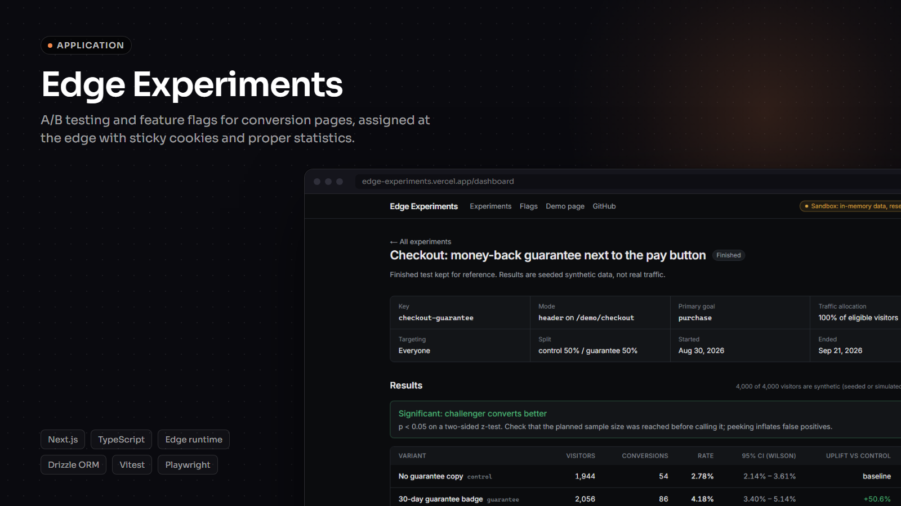
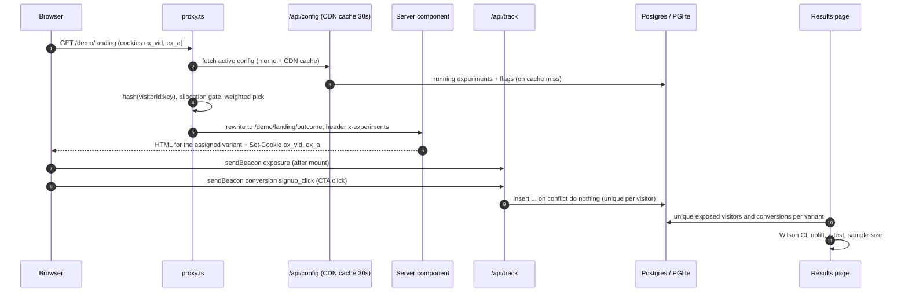

# Edge Experiments

[English](README.md) · [Português](README.pt-BR.md)

Testes A/B e feature flags para landing pages e páginas de vendas, com a variante decidida no `proxy.ts` do Next.js antes de a página renderizar, e uma página de resultados que faz a estatística direito.

[](https://github.com/trichains/edge-experiments/actions/workflows/ci.yml)
[](LICENSE)
[](https://edge-experiments.vercel.app)



## Por quê

Landing pages e páginas de vendas com VSL passam por teste A/B o tempo todo: headline, chamada para ação, oferta, prova social. As ferramentas mais comuns fazem isso no navegador: a página carrega com o texto original, um script decide a variante e depois troca o DOM. Isso causa um flash visível do conteúdo errado, coloca um script que bloqueia a renderização justamente na página que mais importa para a conversão e, muitas vezes, ainda vem acompanhado de um snippet anti-flicker do tipo "esconde a página até a gente decidir".

A decisão da variante não precisa do navegador. Ela precisa de um id de visitante, da configuração do experimento e de um hash. Este projeto toma essa decisão no `proxy.ts` do Next.js (o substituto do middleware no Next 16), antes de qualquer HTML ser gerado, então o visitante recebe a variante certa já no primeiro byte. Depois, registra exposições e conversões por visitante único e mostra os resultados com intervalos de confiança e teste de significância, em vez de um "B está 12% melhor" solto.

## O que faz

- **Definições de experimentos e flags** no Postgres via Drizzle, validadas com zod: status (draft, running, paused, finished), alocação de tráfego, variantes com pesos, regras de segmentação (UTM source/medium igual a, país pelo `x-vercel-ip-country`, mobile/desktop pelo user agent), meta principal e modo `rewrite` ou `header`. Flags têm enabled, % de rollout e kill switch.
- **Bucketing determinístico**: FNV-1a 32-bit (com o finalizador do murmur3 para misturar melhor os bits) sobre `${visitorId}:${experimentKey}`, mapeado para [0, 1). Um hash com salt separado controla o corte de alocação de tráfego, então subir a alocação de 20% para 50% só adiciona visitantes e nunca move quem já estava no experimento.
- **Avaliação na borda no `proxy.ts`**: lê o cookie `ex_vid` (ou gera um UUID), lê o cookie de atribuições `ex_a`, atribui novos experimentos, grava os dois cookies, repassa o resultado para os server components nos headers de requisição `x-experiments` / `x-flags` e, nos experimentos em modo `rewrite`, reescreve `/demo/landing` para `/demo/landing/<variant>` mantendo a mesma URL.
- **Sem banco de dados no proxy**: ele busca `GET /api/config`, um JSON pequeno servido com `Cache-Control: s-maxage=30, stale-while-revalidate=300`.
- **SDK** em `lib/sdk`: `getAssignments()`, `getVariant(key)`, `getFlag(key)` no servidor; `<ExperimentsProvider>`, `useVariant(key)`, `useFlag(key)` e `track(goal, props)` no cliente. As uniões de variantes são tipadas por uma interface de registro (`getVariant("landing-hero")` é `"control" | "outcome" | null`).
- **Tracking**: `navigator.sendBeacon('/api/track')` para exposições (quando a página monta) e conversões. Um índice único em (experimento, visitante, tipo, meta) torna todo evento idempotente, então todas as contagens são de visitantes únicos.
- **Página de resultados** (`/dashboard/experiments/[key]`): visitantes e conversões por variante, taxa de conversão com intervalo de Wilson de 95%, uplift relativo contra o controle, p-valor do teste z bicaudal para duas proporções, um rótulo de veredito, um gráfico de intervalos e uma calculadora de tamanho de amostra (taxa base, MDE absoluto ou relativo, α = 0,05, poder = 0,8). Dá para iniciar, pausar e finalizar na mesma página.
- **Página de flags** (`/dashboard/flags`): liga/desliga, slider de rollout, kill switch.
- **Acesso a alterações**: com `ADMIN_TOKEN` definido, toda alteração exige o token. Sem ele, alterações só são permitidas no modo sandbox; com banco real e sem token, são recusadas.
- **Demo** (`/demo/landing`): uma landing page de um produto fictício de faturamento com duas variantes de hero (headline + texto e cor do CTA), um experimento de prova social em modo header com 50% de alocação e duas flags. Um chip de debug mostra sua variante e tem um link "switch variant". A página de resultados tem um formulário **Simulate traffic**, só no sandbox, que gera visitantes sintéticos com as taxas de conversão reais que você escolher (até 5.000 por execução e 100.000 por experimento).

## Arquitetura



1. O proxy roda só para requisições de página (o matcher ignora `/api`, `/_next` e arquivos estáticos).
2. Ele carrega a configuração de `/api/config` e guarda uma cópia em memória por 30 s em cada instância, além do cache da CDN. Requisições simultâneas compartilham um único fetch. Se a configuração não puder ser carregada, a requisição segue sem alteração e a página renderiza o controle; a falha fica registrada por 5 s para que um endpoint de configuração quebrado não seja chamado a cada requisição.
3. Atribuições já existentes no cookie valem enquanto o experimento estiver rodando (são fixas) e são repassadas em todas as páginas. Novos visitantes só entram no experimento numa requisição para o `path` dele (ou abaixo dele): primeiro a segmentação, depois o corte de alocação, depois a escolha ponderada. Quem não se qualifica não é gravado, então é reavaliado na próxima requisição.
4. Os server components leem a atribuição com `getVariant()` a partir do header repassado. Isso cobre também a primeiríssima requisição, antes de o cookie existir no navegador.
5. O provider do cliente recebe o mesmo snapshot do servidor, então a hidratação bate com o HTML. Depois de montar, ele envia um beacon de exposição para os experimentos que a página realmente renderizou.
6. O `/api/track` pega o id do visitante e as atribuições dos cookies first-party, nunca do corpo da requisição, e valida de novo cada par contra a configuração.

```
proxy.ts               avaliação na borda (importa só de lib/core)
instrumentation.ts     inicializa o banco / PGlite no boot
lib/core/              TS puro, sem I/O: hash, bucketing, segmentação, formato do cookie, evaluate, estatística, schemas zod
lib/sdk/               server.ts (getAssignments/getVariant/getFlag), client.tsx (provider, hooks, track)
lib/db/                schema Drizzle, singleton do cliente pg/PGlite, fixtures, seed
lib/server/            consultas do repositório, verificação do token de admin
app/api/               config, track, flags/[key], experiments/[key], simulate, debug/reset
app/(app)/             landing + dashboard (lista de experimentos, resultados, flags)
app/demo/landing/      página de demo; [variant]/ é o destino do rewrite
drizzle/               migrações SQL geradas
tests/unit/            hash, bucketing, cookies, segmentação, evaluate, estatística
tests/integration/     route handlers no PGlite, proxy.ts com fetch de configuração mockado
e2e/                   testes de fumaça com Playwright
```

## Principais decisões e trade-offs

- **Atribuição no servidor, não no navegador.** O proxy decide antes de renderizar, então o HTML já vem com a variante certa. Sem troca de DOM, sem snippet anti-flicker, sem script extra no caminho crítico. O custo é que as páginas sob experimento são renderizadas a cada requisição, em vez de servidas de um cache estático.
- **Sem banco de dados na borda.** O proxy só lê uma configuração JSON em cache. Um visitante recorrente custa zero consultas, porque as atribuições dele viajam no cookie `ex_a`. Em produção na Vercel, o [Edge Config](https://vercel.com/docs/edge-config) é o lugar mais adequado para esse payload (leitura rápida na borda, atualizações propagadas globalmente); o `/api/config` mantém o projeto autossuficiente. Mudanças na configuração levam até uns 30 s para chegar aos visitantes.
- **Atribuições em cookie, sem assinatura.** O formato é compacto (`landing-hero:outcome;social-proof:logos`, com percent-encoding no cookie porque `;` não é permitido em valor de cookie). Ele não é assinado: um visitante poderia editá-lo para escolher uma variante, o que só muda a experiência dele, e o endpoint de tracking ignora pares que não existem na configuração. Os dois cookies são legíveis por JavaScript de propósito (`httpOnly: false`, `SameSite=Lax`, 1 ano), já que guardam só um id anônimo e chaves de variante.
- **Exposição via beacon, não durante a renderização no servidor.** Registrar a exposição num server component contaria prefetches, refetches de RSC e crawlers que nunca mostram a página para uma pessoa, além de fazer a renderização escrever no banco. Um beacon depois da montagem só dispara num navegador de verdade que exibiu a página. O trade-off: visitantes que bloqueiam JS ou saem antes da hidratação não contam como expostos.
- **Hash determinístico com dois salts.** O mesmo visitante sempre cai no mesmo bucket, em qualquer instância, sem coordenação. A escolha da variante e o corte de alocação usam hashes independentes, então mudar a alocação nunca embaralha quem já está no experimento. O FNV-1a sozinho mistura mal entradas que só diferem no final (`...:exp-a` vs `...:exp-b`), então o valor passa pelo finalizador `fmix32` do murmur3; os testes verificam uniformidade com qui-quadrado e independência entre experimentos.
- **Estatística frequentista, com os limites explícitos.** Intervalos de Wilson se comportam bem com taxas baixas e amostras pequenas, onde a aproximação normal falha. O teste z bate com o `prop.test(correct = FALSE)` do R. O veredito fica oculto abaixo de 100 visitantes por variante. Todas as fórmulas têm testes unitários contra valores de referência publicados.
- **Drizzle com dois drivers.** `pg` quando `DATABASE_URL` está definido, PGlite em memória caso contrário (modo sandbox: migrações aplicadas no boot, fixtures populadas). Mesmo schema, mesmas consultas, e os testes rodam no PGlite sem Docker.
- **Acesso direto às rotas de variante redireciona.** `/demo/landing/outcome` redireciona para `/demo/landing`, para que ninguém veja uma variante enquanto é contado em outra.

## Stack

Next.js 16.3 (App Router, `proxy.ts`), React 19, TypeScript (strict), Tailwind CSS v4, Drizzle ORM com `pg` e `@electric-sql/pglite`, zod 4, Vitest, Playwright (Chromium).

## Rodando localmente

Pré-requisito: Node 22 ou mais recente.

```bash
npm install
cp .env.example .env.local   # opcional: deixe DATABASE_URL vazio para o modo sandbox
npm run dev                  # http://localhost:3102
```

Com Postgres:

```bash
# defina DATABASE_URL no .env.local e depois
npm run db:migrate           # aplica drizzle/*.sql
npm run dev                  # popula as fixtures da demo se a tabela experiments estiver vazia
```

| Variável | Obrigatória | Para quê |
| --- | --- | --- |
| `DATABASE_URL` | não | String de conexão do Postgres. Vazia significa modo sandbox (PGlite em memória). |
| `NEXT_PUBLIC_APP_URL` | recomendada em produção | URL pública, usada nos metadados. Na Vercel cai para `VERCEL_PROJECT_PRODUCTION_URL` e, por fim, para `http://localhost:3102`. |
| `ADMIN_TOKEN` | necessária para alterar qualquer coisa quando `DATABASE_URL` está definido | Alterações no dashboard exigem `Authorization: Bearer <token>`. Sem ela: liberadas no modo sandbox, recusadas com banco real. |

Testes:

```bash
npm run lint
npm run typecheck
npm test                            # unitários + integração (Vitest, PGlite)
npm run build && npm run test:e2e   # Playwright contra o build de produção na porta 3102
```

Os testes de estatística citam as referências no próprio arquivo: `qnorm`/`pnorm` e `prop.test` do R, os valores clássicos do intervalo de Wilson e a calculadora de tamanho de amostra do Evan Miller.

## Demo e limitações

A demo pública roda em modo sandbox: os dados ficam em memória e são zerados sempre que a instância do servidor reinicia. Os resultados pré-carregados (um teste de checkout finalizado e um pouco de tráfego no landing-hero) são sintéticos e aparecem rotulados assim na página de resultados. Cada instância serverless tem sua própria cópia do PGlite, então duas requisições podem ver dados diferentes num deploy com bastante tráfego; com `DATABASE_URL` definido isso deixa de acontecer.

No modo sandbox sem `ADMIN_TOKEN`, qualquer pessoa usando a demo pode ligar e desligar flags, pausar experimentos ou simular tráfego. Isso é intencional numa demo, e tudo volta ao estado inicial no próximo cold start.

Em deploys de preview da Vercel com Deployment Protection ativado, a requisição do proxy para o próprio `/api/config` recebe 401, então todo visitante vê o controle. Deploys de produção não são afetados. Para testar experimentos num preview protegido, use um bypass da proteção ou aponte o proxy para uma fonte de configuração sem proteção (o Edge Config evitaria essa requisição para si mesmo).

Limitações conhecidas:

- Sem teste sequencial nem análise bayesiana. Olhar o p-valor todo dia e parar no primeiro p < 0,05 aumenta os falsos positivos; a interface avisa e mostra o tamanho de amostra planejado, mas não obriga a respeitá-lo.
- Sem correção para comparações múltiplas em experimentos com mais de um desafiante. Os experimentos da demo têm duas variantes.
- Ainda sem checagem de sample ratio mismatch.
- As conversões são atribuídas à meta principal de cada experimento em andamento em que o visitante está. Não há janela de atribuição nem métrica de receita.
- O `/api/track` não tem rate limiting nem filtro de bots. Quem tiver o cookie de um visitante pode enviar eventos por ele (deduplicados, então no máximo uma conversão por meta).
- O dashboard não tem contas de usuário. O `ADMIN_TOKEN` é um único segredo compartilhado para alterações; a leitura é pública.
- O Next.js 16 roda o `proxy.ts` no runtime Node.js por padrão. O proxy só usa Web APIs e não importa nada da camada de banco, então rodaria sem mudanças num runtime edge, mas "borda" aqui descreve em que ponto da requisição a decisão acontece, não uma flag de runtime.

## Roadmap

- Alerta de sample ratio mismatch (qui-quadrado entre a divisão observada e a configurada).
- Teste sequencial (mSPRT ou alpha spending) para poder acompanhar os resultados continuamente.
- Editor de experimentos no dashboard (hoje as definições vêm do seed ou são escritas via SQL).
- Adaptador de Vercel Edge Config para a configuração do proxy, com `/api/config` como fallback.
- Cookie de atribuição assinado (HMAC via Web Crypto) para times que querem impedir autosseleção.
- Métricas secundárias e uma meta de receita.

## Licença

[MIT](LICENSE) © 2026 Cristhian Almeida
